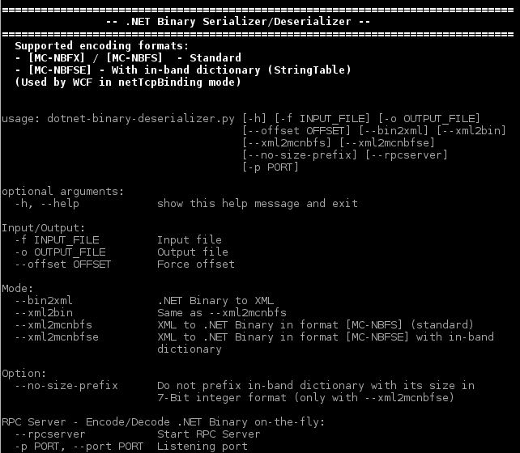
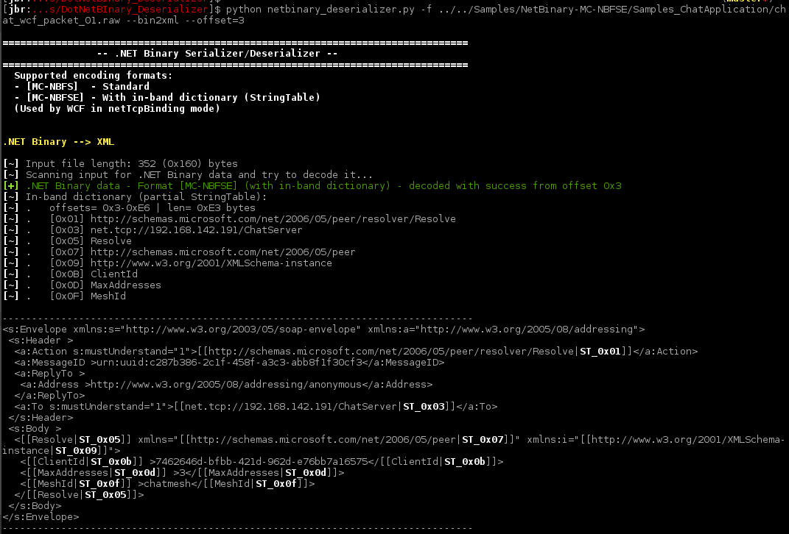

.NET Binary Deserializer
====




Quick usage examples
----
* Decode .NET binary (auto detect encoding) into XML:
```bash
python /home/jbr/github/dotnet-binary-deserializer --bin2xml -f <input_netbin_filename> -o <output_filename>
```

* Convert XML into .NET Binary in standard encoding - format [MC-NBFS]:
```bash
python /home/jbr/github/dotnet-binary-deserializer --xml2mcnbfs -f <input_xml_filename> -o <output_filename>
```

* Convert XML into .NET Binary using in-band dictionary / StringTable - format [MC-NBFSE]:
```bash
python /home/jbr/github/dotnet-binary-deserializer --xml2mcnbfse -f <input_xml_filename> -o <output_filename>
```



Overview
----

### Deserialization
TODO

### Serialization
TODO